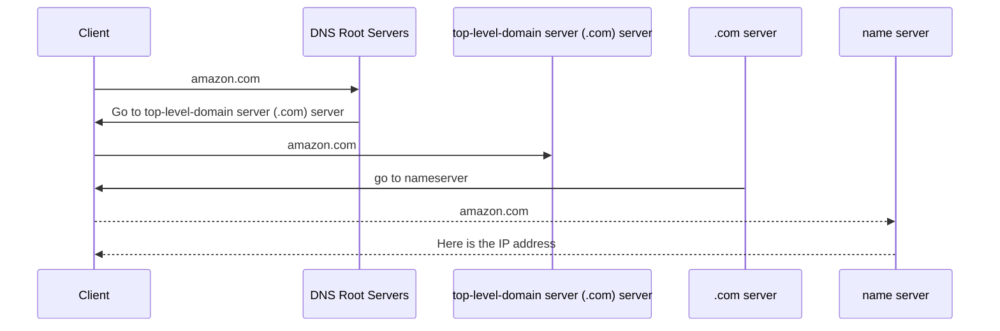

# DNS 101

- a discover service
- finds the IP address for a given domain name
- huge and distributed
- DNS Root Servers ran by 12 large organizations
- DNS Root Zone managed by IANA
- a registry is an organization to maintains the zones for top level domains

- `DNS Client` : software on device being used
- `Resolver` : software on device or server that queries DNS on your behalf
- `Zone` : a part of the DNS database
- `Zonefile` : physical database for a zone
- `Nameserver` : where zonefiles are hosted

---

Getting the IP:

## DNS Record Types

### Nameserver (NS)

- enable delegation end to end

`root zone --> TLD zone --> domain zone`

### A and AAAA Records
- map host names to IP
  - A maps to IPv4
  - AAAA maps to IPv6

### Canonical Name (CNAME) Records

When a specific server performs multiple services:
  - create multiple names and point them to the same A server record
    - so they point the same IP
  - can't point to IP address only to names

### MX Records
- used to find mail servers for a specific domain

### TXT Records
- used to prove domain ownership
- and detecting spam

### Time To Live TTL
- how long a result is cached at a resolver server (probably ISP)
- used for quicker access
