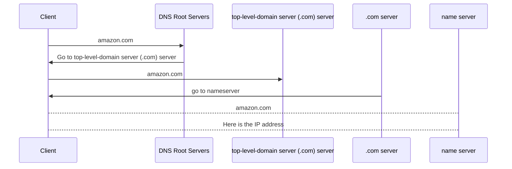

# DNS 101

- a discover service
- finds the IP address for a given domain name
- huge and distributed

- `DNS Client` : software on device being used
- `Resolver` : software on device or server that queries DNS on your behalf
- `Zone` : a part of the DNS database
- `Zonefile` : physical database for a zone
- `Nameserver` : where zonefiles are hosted

---

Getting the IP:

