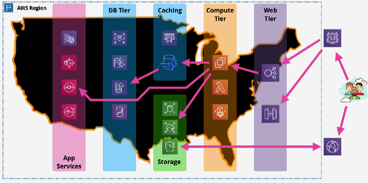

# High Availability and Scaling

## Regional and Global AWS Architecture

- `R53` (DNS Service)
  - `Global Service Location and Discovery`
    - how does your machine discover where to point at
  - `Global Health Checks and Failover`
    - detecting if infrastructure is healthy or not in a one location and moving customers to another Country as required
- `CloudFront`
  - `Content Delivery` (CDN) and optimization
    - how does content get to users globally : from distributed or central location
    - cache content globally as close to end user as possible to improve performance

- `web tier`
  - provide entry point to customer
  - abstracts internals away from customer
- `compute tier`
  - provide functionality for the customer
- `storage tier`
  - provide storage for compute infrastructure
- `cache tier`
  - faster data access by caching data
  - reduce db reads, to improve performance and reduce costs
- `db tier`
  - data storage
- `app service`
  - provide functionality to applications like queues, data streaming etc.

- `Regional Scaling and Resilience`

## Elastic Load Balancer Evolution

- 3 types of load balancers (ELB) available
  - split between between v1 (avoid) and v2(prefer)
- CLB (v1), lacking features, more expensive
- Application Load Balancer (ALB)
  - HTTP/S/WebSocket
- Network Load Balancer (NLB)
  - TCP/TLS/UDP
  - email, ssh
- v2 : faster, cheaper, support target groups and rules

## Elastic Load Balancer Architecture

- accept connections from customers and distribute them across any registered backend compute
- `abstracts user away from physical infrastructure`
  - means the amount of infrastructure can change without affecting customers
  - infrastructure can fail and be repaired, hidden from customers
- pick if using ipv4 only or ipv4 and ipv6
- pick which AZs the load balancer will use
  - `2 or more AZs`
  - `one subnet` per AZ
  - one load balancer is made up of `many nodes`
  - product places one or more load balancer nodes into the subnets
- load balancer created with a `DNS record` 
  - A record
  - `points to all of the ELB nodes` created with the product
  - incoming requests are `distributed equally across all the nodes`
  - nodes scale within the AZ
    - `HA` : if one fails it is replaced
    - if load increases, then addition nodes are provisioned
- `Internet facing `: have private and public IPs
- `Internal` : have only privates IPs
  - generally used to separate different tiers of applications
    - like web,app,db etc.
  - `allows tiers to scale independently of each other`
- Nodes are configured with `listeners`
  - controls what the load balancer is listening to
  - accept traffic on a part and protocol
  - communicate with targets on a port and protocol
- nodes can make connections with instances that are registered with the load balancer
  - `can connect to both public and private` instances
- need `8+ freeIPs` per subnet and a `/27` or larger subnet to allow for scale
- `Cross-Zone Load Balancing`
  - allows node to distribute connections equally across `all registered instances across all AZs`
  - allows for more even load balancing : when different AZs have unequal compute infrastructure

## Application vs Network Load Balancers (ALB vs NLB)

`Load Balancer Consolidation`
- `Classic Load Balancer`
  - clb has an attached ssl certificate and autoscaling group
  - clb distributes incoming connections to instances
  - `doesn't scale`; every unique https application name requires an individual clb because SNI isn't supported

- `V2 Load Balancers`
  - can use one load balancer for multiple applications
    - allows consolidation
  - `listener based rules`
    - can hold multiple ssl certificates
  - `host based rules`
    - using SNI
    - direct incoming connections at multiple target groups
  - `target groups ` forward connections to multiple scaling autoscaling groups

- `Application Load Balancer (ALB)`
  - Layer 7 load balancer
    - `listens on HTTP or HTTPS only`
      - must have `SSL certs if HTTPS is used`
  - connection are terminated on the ALB
    - `no unbroken SSL connection`
    - a new connection is made to the application
  - `slower than NLB` : since more levels of network stack to process
  - `application aware health checks`
  - `rules` 
    - direct connections which arrive at a listener
    - processed in priority order
    - `default rule = catchall`
    - `rule conditions`
      - content type, cookies, custom headers, user location and app behavior
      - host-header, http-header, http-request-method
      - path pattern, query string
      - source ip
    - `actions`
      - forward, redirect, fixed-response, authenticate-oidc, authenticate-cognito

- `Network Load Balancer (NLB)`
  - `layer 4 : TCP, TLS, UDP, TCP_UDP`
    - `no  HTTP or HTTPS`
  - `really fast` (millions of rps, 25% of ALB latency)
  - `health checks are not application aware`
  - can have `static IP's` : useful for `whitelisting`
  - can forward TCP to instances
    - `unbroken end to end encryption`
  - used with private link to provide services to other VPCs

`Deciding on One`
- NLB
  - unbroken encryption 
  - static IP for whitelisting
  - fastest performance
  - protocols not HTTP or HTTPS
  - private link
- ALB
  - anything else

## Launch Configuration and Templates

- `define the configuration of an ec2 instance in advance`
  - AMI, Instance Type, Storage, Key Pair
  - Network and Security Groups
  - Userdata and IAM role
- not editable
  - LT has versions
- `LT has newer features`
  - recommended over LC
  - Placement Groups
  - Capacity Reservations
  - Elastic Graphics
  - T2/T3 Unlimited
- LC are used for autoscaling groups
- LT 
  - used for  autoscaling groups
  - used to `launch ec2 instances directly`

## Auto Scaling Groups

- configure ec2 to `scale automatically depending on demand`
  - `When and Where` to launch to
- `self healing`
  - uses ec2 health checks
  - terminates bad ones, and provisions a new one in its place
- uses launch template/configuration to know what to launch
- `minium, desired, max`
  - x:y:z
- keep running instances at the desired capacity byb provisioning or terminating instances
- `scaling policies`
  - update desired based on metrics ie) cpu load
  - `manual scaling` : manually adjust the desired capacity
  - `scheduled scaling` : time based adjustment
    - for periods of low or high usage
  - `dynamic scaling`
    - `simple`
      - rule based on metric to provision or remove instances
    - `stepped scaling`
      - bigger +/- based on difference
      - allow you to act quicker to extreme changes
      - `preferred` over simple
    - `target tracking`
      - define a metric to maintain
- `run within a vpc`
  - subnets within the vpc are configured on the autoscaling groups
  - configured subnets will be used to provision instances
  - there will be an attempt to keep the number of instances in each subnet equal
- `cooldown period`
  - how long to wait after a scaling action before doing another one

- `Integration with Load Balancers`
  - used with ALB for `elasticity`
  - ASH instances can automatically be added to or removed from a load balancers target group
  - `can use load balancers health checks
`
- `Scaling Processes`
  - `launch and terminate`
    - suspend and resume
  - `AddToLoadBalancer`
    - if instances is added to LB on launch
  - `AlarmNotification`
    - accept notifications from CW
  - `AZRebalance`
    - balance instances evenly across all of the AZs
  - `HealthCheck`
    - on/off
  - `ReplaceUnhealthy`
  - `ScheduledActions`
    - on/off
  - `Standby`
    - protect instance from ASG, when doing maintenance

- `Cost`
  - ASH are Free
  - only resources created are billed
  - use cooldowns to avoid rapid scaling
  - think about more smaller instances
