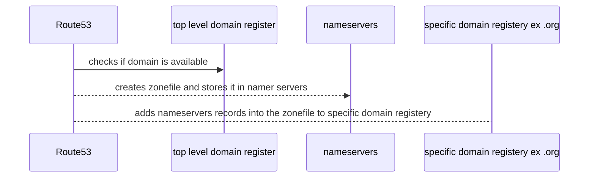

# Route53

- global service
- globally resilient (replicated between regions)

Services

1. Register Domains

2. Host Zonefiles on managed nameservers

## R53 Public Hosted Zones

- `Hosted Zone` : a DNS DataBase (zone file) for a domain
  - what the DNS System references 
  - created with domain registration iva R53 or separately
- accessible from the public internet and VPCs
- Hosted on `4` R53 name servers specific for the zone
  - use ns records to point at these ns
- resource records (`RR`) created within the hosted zone (items of data that dns uses)
- externally registered domains can point at R53 public zone

