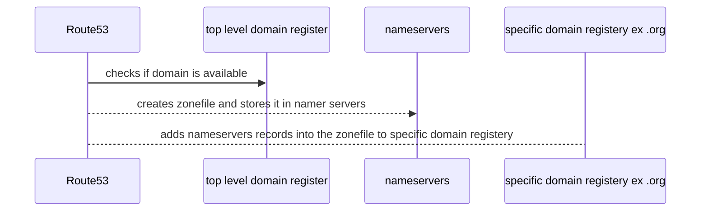

# Route53

- global service
- globally resilient (replicated between regions)

Services

1. Register Domains

```mermaid
    sequenceDiagram
        Route53 ->> top level domain register : checks if domain is available
        Route53 -->> nameservers : creates zonefile and stores it in namer servers
        Route53 --> specific domain registery ex .org : adds nameservers records into the zonefile to specific domain registery
```

2. Host Zonefiles on managed nameservers
