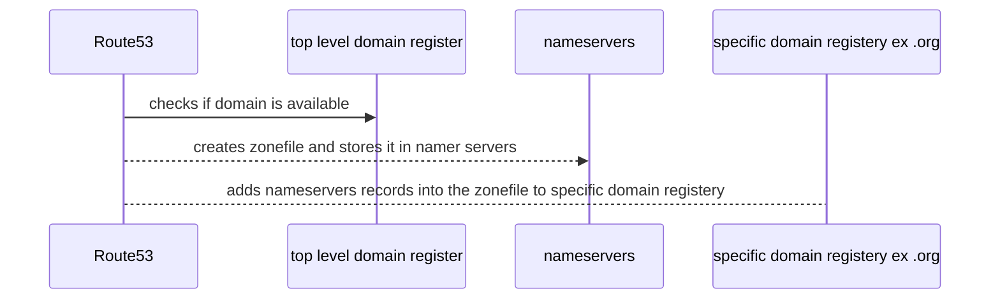

# Route53

- global service
- globally resilient (replicated between regions)

Services

1. Register Domains

2. Host Zonefiles on managed nameservers

## R53 Public Hosted Zones

- `Hosted Zone` : a DNS DataBase (zone file) for a domain
  - what the DNS System references 
  - created with domain registration iva R53 or separately
- accessible from the public internet and VPCs
- Hosted on `4` R53 name servers specific for the zone
  - use ns records to point at these ns
- resource records (`RR`) created within the hosted zone (items of data that dns uses)
- externally registered domains can point at R53 public zone

## R53 Private Hosted Zone

- `associated with VPC's`, and only accessible in those VPCs
  - using different account using cli/api
- `split-view` : overlapping `public` and `private` 
  - for `public` and `internal` use with the same zone name

## CNAME vs R53 Alias

- `cname` maps a name to another name
  - ex) www.cat.op => cat.io
  - invalid for naked/apex (cat.io)
- many aws services use a dns name (ELBs)
  - with cname, cat => elb would be invalid
- `alias` : map a name to an aws resource
- can be used for naked/apex and normal records
  - for non apex/record functions like cname
- no charge for alias requests pointing at aws resources
- multiple types
  - should be the same type as what the record is pointing at

## Simple Routing

- `1` record per name (www)
- each record can have `multiple values`
  - all values are returned to client, then client chooses one
- `use case` : when you want to route requests towards one service such as a web server
- `doesn't support health checks`

## Health Checks

- separate from, but are used by records
- `health checkers` located globally
- health checks check every 30s (every 10s costs extra)
- TCP, HTTP/HTTPS,  HTTP/HTTPS with string matching
  - where a health checker makes a TCP connection and expects an response within a time limit
- states : `healthy` or `unhealthy`
- type:
  - `endpoint` : assess the health of an endpoint that you specify
  - `cloudwatch` : react to cloudwatch alarm
  - `checks of checks (calculated)` : includes multiple checks

## Failover Routing

- can add multiple records of the same name
  - a `primary` and `secondary`
- if the primary record is healthy
  - any queries return the primary record
- if the primary record is not healthy
  - any queries return the secondary record
- `use case` : when you want to configure active passive failover
  - route traffic to a resource when the resource is healthy or to a different resource when the first resource is unhealthy

## Multi Value Routing

- like a mixture of simple and failover routing
- can create many records with the same name
  - each mapping to an ip address
  - each can have an associated health check
  - when queried up to 8 healthy records are returned
    - if you have more than 8, then 8 are selected random
  - client picks which to use
- improves the availability, but not a replacement for load balancing

## Weighted Routing

- simple form of load balancing or testing new software versions
- can create multiple records with the same name
- each record has a record weight associated with it
- each record is returned based on the ratio of its weight to the total record weights
- can be associated with a health check
  - if a chosen record is unhealthy, then the process of selection is repeated until  a healthy one is chosen

## Latency-Based Routing

- used when optimizing for performance and user experience
- can create multiple records with the same name
- each record can have a record region associated with it
  - latency based routing supports one record with the same name in each aws region
- aws maintains a database of latency between the users general location and the regions tagged in records
- the record returned is the one which offers the lowest estimated latency and is healthy
  - if a record is unhealthy, then the next lowest latency is returned
