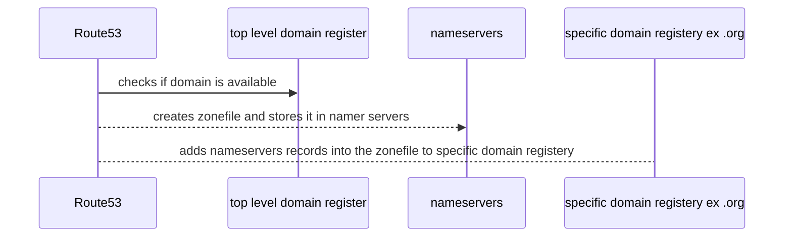

# Route53

- global service
- globally resilient (replicated between regions)

Services

1. Register Domains

2. Host Zonefiles on managed nameservers

## R53 Public Hosted Zones

- `Hosted Zone` : a DNS DataBase (zone file) for a domain
  - what the DNS System references 
  - created with domain registration iva R53 or separately
- accessible from the public internet and VPCs
- Hosted on `4` R53 name servers specific for the zone
  - use ns records to point at these ns
- resource records (`RR`) created within the hosted zone (items of data that dns uses)
- externally registered domains can point at R53 public zone

## R53 Private Hosted Zone

- `associated with VPC's`, and only accessible in those VPCs
  - using different account using cli/api
- `split-view` : overlapping `public` and `private` 
  - for `public` and `internal` use with the same zone name

## CNAME vs R53 Alias

- `cname` maps a name to another name
  - ex) www.cat.op => cat.io
  - invalid for naked/apex (cat.io)
- many aws services use a dns name (ELBs)
  - with cname, cat => elb would be invalid
- `alias` : map a name to an aws resource
- can be used for naked/apex and normal records
  - for non apex/record functions like cname
- no charge for alias requests pointing at aws resources
- multiple types
  - should be the same type as what the record is pointing at
