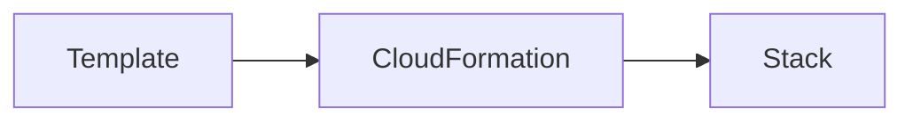

# CloudFormation

Create aws infrastructure by creating templates.
- templates can be either YAML or JSON

## Sections
### AWS Template Format Version
- used to allow extending the service when new versions come out

### Description
- describe you template
- if the template format version is in the templates, it must come before this section

### Metadata
- template metadata

### Parameters
- set of parameters

### Mapping
- set of mappings
- create look tables

### Conditions
- set of conditions
  
### Transforms
- set of transforms

### Resources
- mandatory section of a cloudformation template
- list of logical resources
- generally have properties used to configure the resources

### Outputs
- what to return once a resource is created

## Flow 

- a stack is a living and active representation of the template
- contains the logical resources from the template
- cloudFormation will also create the physical infrastructure of the the logical resources