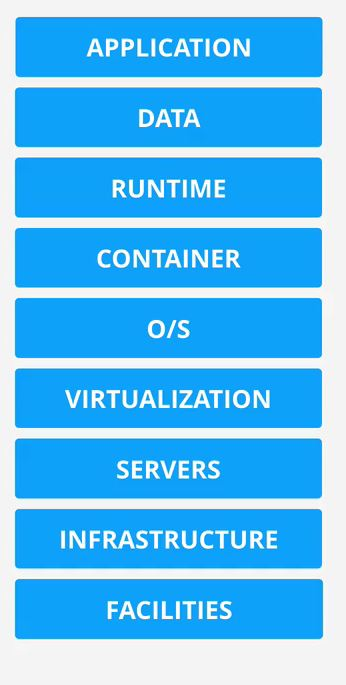

## Cloud Computing

Five general ; characteristic of cloud systems

1. `On demand self service` : provision and terminate using UI/CLI without human interaction
2. `Broad Network Access` : available over any `network` and access through `standard mechanisms`
3. `Resource Pooling` : economies of scale, cheaper services
4. `Rapid Elasticity` : can be elastically provisioned to `scale rapidly outward and inward with demand`
5. `Measured Service` : resource usage is measured, pay for what you use

## Public vs Private vs Hybrid vs Multi Cloud

- `public cloud`
  - aws, azure, gcp
- `multi-cloud`
  - using a combination of public cloud service providers
- `private`
  - on-premises version of `real` cloud
- `hybrid`
  - both public and private

`Hybrid cloud is not public cloud + legacy on-premises`

## Service Models
Different levels of service models, that differ on how much of the infrastructure stack is handled by a user.

- Infrastructure as a Service (IAAS) 
  - `facilities, infrastructure, servers, and virtualization` are abstracted away
  - deal with everything else
- Platform as a Service (PaaS)
  - OS, Containers are further abstracted away
- Software as a Service (SaaS)
  - only interact with the application
