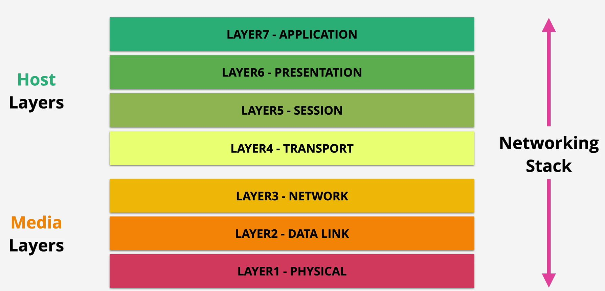

# Networking

## OSI 7-Layer Model (networking Stack)

- `media layers` : dealing with how data moves from point a to point b
- `host layers` : deal with how data is chopped up and reassembled for transport

## Layer 1 : Physical

- layer 1 (physical) specifications define the `transmission and reception` of raw bit streams between a device and a shared physical medium
  - defines things like voltage levels, timing, rates ...
- devices with the same specification have a shared understanding of a physical medium that connects them, thereby allowing them to `communicate`
- if multiple devices transmit at once, a `collision` occurs, no collision detection
- `no access control` : no control which devices can transmit
- `no uniquely identified devices`
- one broadcast and one collision domain

`hub`
- multi-port device connecting devices on layer 1 level
- propogates collisions in one port to all ports`

## Layer 2 : Data Link

Introduces a unique hardware address for every device on a network (`MAC addresses`)

Introduces `frames`: A format for sending data over an layer 2 network

1. `preamble and start frame delimiter` : allow devices to identify the start of the frame
2. `destination MAC address`
3. `source MAC address`
4. `Ether type` : specify which layer 3 protocol is putting dat in frame
5. `payload` : data the frame carries
6. `frame check sequence` : check for corruption

*1, 2 3 are considered the MAX HEADER*

layer 2 frames generated from source side -> passed to layer 1 -> raw data passed to physical medium -> taken off physical medium at destination side -> passed to layer 2 software to interpret the frame

`Carrier Sense Multiple Access (CSMA)`
- used to look for a carrier signal (if anyone other device is sending a message on the network)
- if no carrier, data is sent to layer 1 to be transmitted through the medium

`Collision Detection (CD)`
- a jam signal is sent by devices that detect a collision, then a random back off occurs
  - back off : random period of time where no device will send a message

`Switch`
- multi-port device that connects multiple devices on a layer 2 level
- only send valid frames so collisions are isolated on the port, x-ports -> x-collision domains

Decimal and Binary Conversion
| position              | 1   | 2   | 3   | 4   | 5   | 6   | 7   | 8   |
| --------------------- | --- | --- | --- | --- | --- | --- | --- | --- |
| Binary Position Value | 128 | 64  | 32  | 16  | 8   | 4   | 2   | 1   |

## Layer 3 : Network
Internet Protocol (IP) is a Layer 3 protocol which adds cross-network IP addressing and routing to move data between local area networks.

`IP Packet` : Generally store data from layer 4.

`v4`
- Protocol : layer 4 protocol to pass data into
- source and destination IP addresses
- time to live
- data

`v6`
- larger source and destination IP addresses
- hop limit instead of time to live

Packets move between intermediary layer 2 network. Each time, the packet will be encapsulated in a frame specific to the network.

`IP Address (v4)`
- 4 dotted numbers
  - first two represent the network part, and the last two are the host part
  - if the network part of two ip addresses match, then they are on the same ip network
  - assigned by machine (DHCP) or human

`default gateway`  is an IP address on a local network, which packets are forwarded to, if the intended IP location is not local

`Subnet Mask` : allow an IP device to know if an IP address it's trying to communicate with is on the same network or not

- if the IP address is not local, then it forwards the packets to a `default gateway`

`routing` : the process where packets hop across the internet tp get to a destination from a source, through `router` devices

`route tables` : enables routing.
- has destination IP's mapped to Traget IP's
- routers compare destination IP and route table
- routers then send the packet to the target IP that best matches against the destination IP

*local default route 0.0.0.0/0 sends all packets to isp*

`Address Resolution Protocol (ARP)`
- a process that runs between layer 3 and layer 2
- used to find the MAC address if devices in a different IP address

## Layer 4 : Transport
- TCP and UDP run on top of IP networks, TCP is more reliable while UDP is faster

`TCP`
- container for data.
- contained within packets

`Source and destination port`
- gives the ability to have multiple streams of conversation at the same time between two devices

`sequence number`
- unique
- incremented with each segment that is sent
- can be used for error correction, or to maintain order
- is a way of uniquely identifying a particular segment of a particular connection so that both sides can make observations about it (using acknowledgments)

`acknowledgment`
- how one side indicates it as received up to and including a certain sequence number
- every segment transmitted needs to be acknowledged

`flags`
- flags are used to close the connection or synchronize sequence numbers

`window`
- flow control, lets receiver control the rate the sender sends data
- defines the number of bytes a device is willing to receive between acknowledgements
- once reached the send will pause until devices acknowledges that amount of data

`checksum`
- error checking, and arrange for retransmission of data

`urgent pointer`
- used to define the priority of traffic, ie specific data within a segment is urgent and should be prioritized

`3-way handshake`
- client sends its sequences to server
- server sends message acknowledging client sequence and its own server sequence
- client acknowledges server sequence

`Sessions and State`
- a stateless firewall (NACL on AWS) has two rules
  - one outbound and one inbound rule
- a stateful firewall sees on thing
  - allowing an outbound implicitly allows the inbound response

## Network Address Translation (NAT)
- designed to overcome IPv4 shortages and some security benefit
- translates private IPv4 addresses to Public

*IPv4 addresses are either publicly routeable or fall within the private address space*

`Static NAT`
- 1 private to 1 fixed public address (`IGW on aws`)
- used when private IP needs access to the internet and needs a consistent public IP
- the router (NAT device) maintains a NAT table, that maps `privateIP:PublicIP`

`Dynamic NAT`
-  pool of public IP addresses to use, which are temporarily allocated as needed
   -  external access can fail if if the pool is exhausted
-  occurs when you have less public than private addresses

`Port Address Translation (PAT)`
- many private address to 1 public address (`NATGW on aws`)
  - commonly experience in home or office networks where private IPv4 addresses are translated to a single public address, allowing outgoing internet access.
- uses ports to identify individual devices

1. local device has a privateIP and a private source port
2. sends a packet to a router
3. router has a nat table that maps `privateIP : publicIP` and `privatePort : publicPort`, and routes the packet
4. the response, reaches the routers, get translated using the NAT table, then get sent to the correct local device

## Subnetting
- splitting a larger down to smaller networks by splitting the range of IP's available

## Distributed Denial of Service (DDos)
- attack designed to `overload` websites

1. `Application` layer - HTTP Flood
   - exploit that requests are cheap but responses are computationally expensive for servers 
   - many bots send request to the same endpoint
2. `Protocol` Attack - SYN Flood
  - bots send syns (connection initiations) with spoof IPs, network will be hung trying to connect with the fake IP's
3. `Volumetric` - DNS Amplification
  - exploit a response where a response is significantly larger than the request

## Secure Sockets Layer (SSL) and Transport Layer Security (TLS)
- TLS is newer version of SSL
- privacy and data integrity between client and server

`privacy`
- communications b/w client and server are encrypted
- starts with `asymmetric` to `symmetric`encryption

`identity`
- verify client and server

`reliable`
- protect against data alteration

1. Verify the identity of the server
2. negotiate an encryption method to use
3. exchange asymmetric for symmetric encryption keys
4. initiate connection