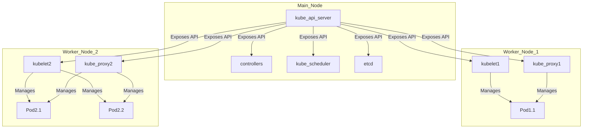
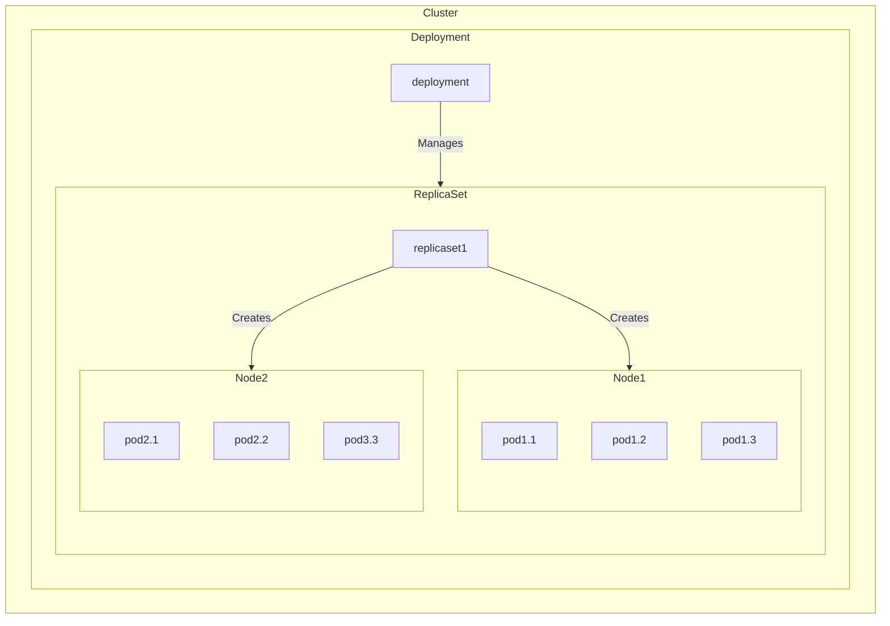
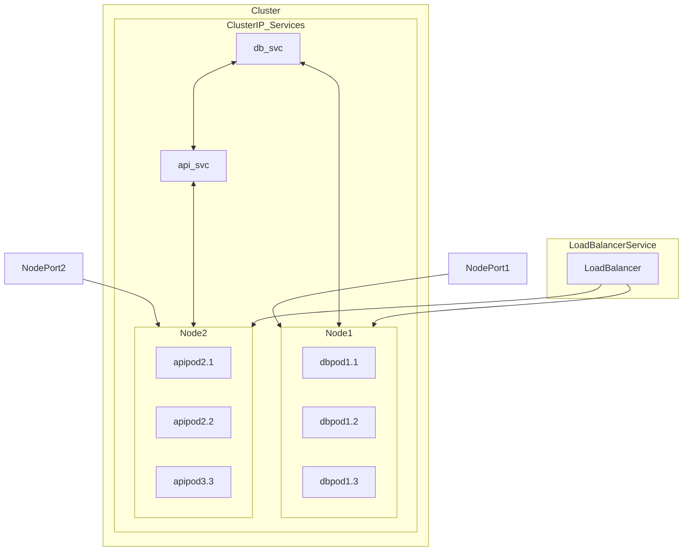
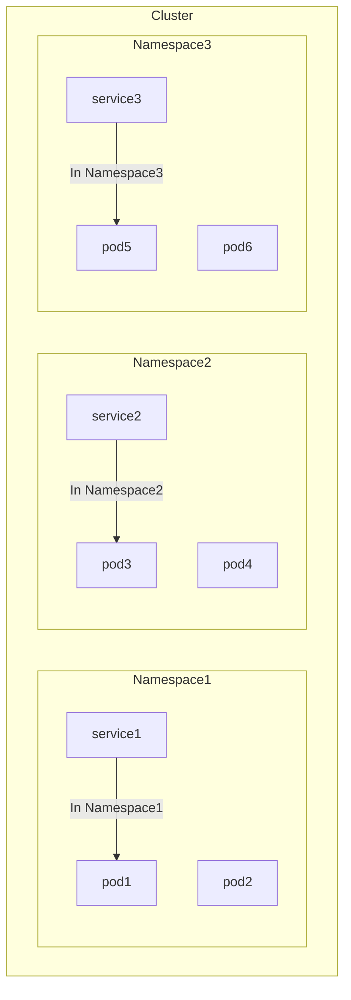

# Core

## Main K8s Cluster Architecture
- Main Node:
  - `etcd`: A distributed key-value store that stores the cluster's configuration data and provides a reliable source of truth.
  - `kube-scheduler`: Assigns Pods to nodes based on resource availability and other constraints.
  - `kube-controller-manager`: runs controller processes that loop to regulate the state of the system to achieve the desired state.
  - `kube-api server`: Exposes the Kubernetes API and acts as the front end for the Kubernetes control plane.

- Worker Nodes:
  - `kubelet`: An agent that runs on each worker node and ensures that containers are running in a Pod.
  - `kube-proxy`: Maintains network rules on nodes, enabling communication between Pods and external traffic.

---

### Main K8s Resources
- **Pods:** The smallest deployable units in Kubernetes, consisting of one or more containers and shared resources, enabling the deployment of applications.
- **ReplicaSets:** Kubernetes controllers that ensure a specified number of pod replicas are running, providing scalability, fault tolerance, and the ability to manage multiple identical instances.
- **Deployment:** A higher-level abstraction managing ReplicaSets, enabling declarative updates, rollbacks, and the definition of desired application states in Kubernetes.

- **Services:** Abstractions that define logical sets of pods and policies for accessing them, facilitating communication within the cluster or from external sources, with types such as NodePort, ClusterIP, and LoadBalancer.
  - **NodePort:** Exposes a service on a static port on each cluster node, enabling external access to the service.
  - **ClusterIP:** Exposes a service on a cluster-internal IP address, allowing communication only within the cluster.
  - **LoadBalancer:** Exposes a service externally using a cloud provider's load balancer, distributing incoming traffic across multiple pods for scalability and availability.

- **Namespaces:** Virtual clusters within a Kubernetes cluster, providing a way to partition and isolate resources, enabling multiple teams or projects to share the same cluster without interference.

